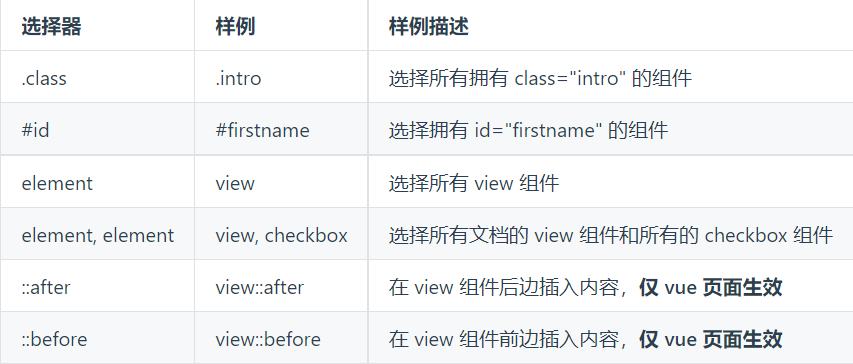
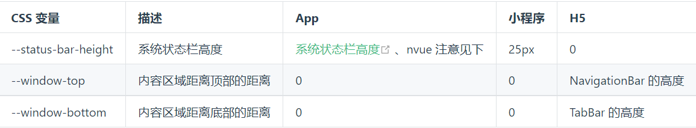

# css语法

## 单位

长度单位可以使用 `rpx` 来代表相对大小

还有以下支持的单位

- px
- rem
- vh
- vw

## 支持的选择器

并非所有选择器都能兼容，具体内容如下:



## 内置css变量



## 布局

在 `uni-app` 中尽量使用 `flex` 布局，这有更好的兼容性

## 背景图片支持问题

`uni-app` 不支持本地的背景图片，图片小于 `40kb` `uni-app` 会自动转换成 `base64` 格式，否则就需要将大图片上传服务器，通过网络方式进行引用

`css` 引入图片时，可以使用 `~@` 作为绝对路径进行引入

```css
.test2 {
	background-image: url('~@/static/logo.png');
}
```

> 注意: 微信小程序不支持相对路径

> 尽量减少大图片的本地使用，若要使用请先上传服务器，然后通过网络路径拉取图片
