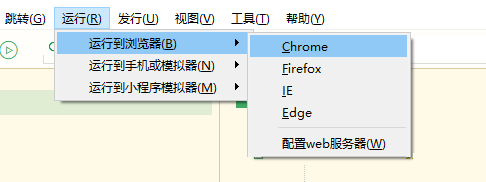
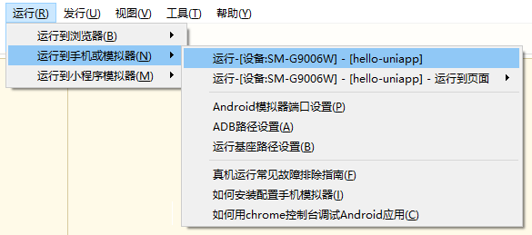
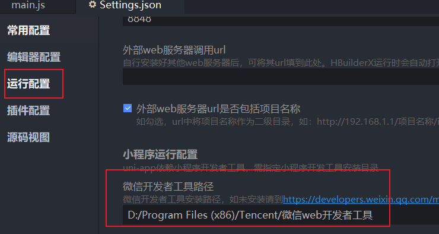
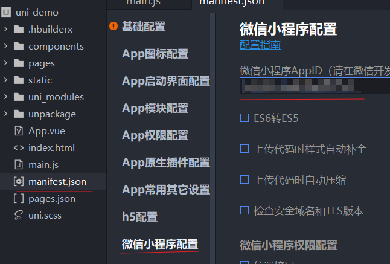
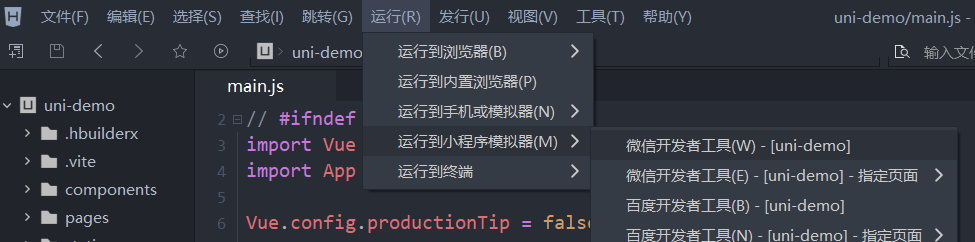
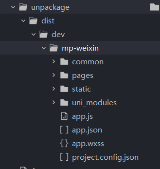
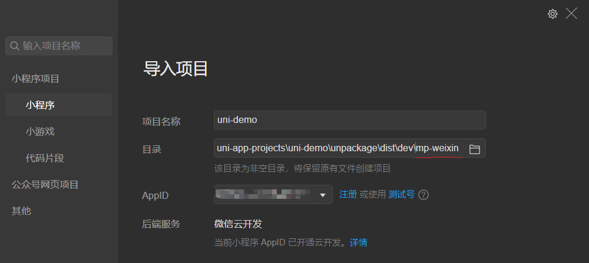
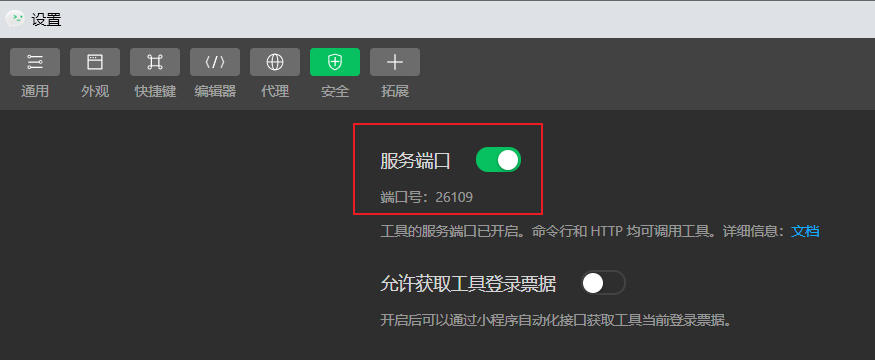

# uni-app环境搭建

推荐使用 `HBuilder` 来搭建环境和创建项目

## 下载 HBuilder

[下载地址](https://www.dcloud.io/hbuilderx.html)

> 请尽量下载最新 HBuilder 否则有些功能可能无法使用

## 创建 uni-app 项目

[创建项目参考](https://uniapp.dcloud.io/quickstart-hx.html#%E5%88%9B%E5%BB%BAuni-app)

创建项目时可以选择使用 `uni-app` 提供的 `uni-ui` 模板。该模板不需要额外的依赖引入，已经被设置好了，开箱即用

`uni-ui` 是 `dclould` 为 `uni-app` 开发的一套 ui 框架，专门用于跨平台 ui 显示

## 运行 uni-app 项目

[运行项目参考](https://uniapp.dcloud.io/quickstart-hx.html#%E8%BF%90%E8%A1%8Cuni-app)

运行时分三种情况讨论，一种是运行到浏览器，一种是运行到 `android` 手机，一种是运行到微信小程序模拟器

### 运行到浏览器

选择一个浏览器运行即可

### 运行到 `android` 手机

#### 开启开发者模式

请先开启 `android` 手机的 `usb调试`，并开启 `usb安装`

打开 `手机设置 -> 我的设备 -> 全部参数`

找到自己系统的版本号信息框，连续点击，直到提示开发者模式已打开为止

#### 打开usb调试和usb安装

然后找到 `手机设置 -> 更多设置 -> 开发者选项`

确保 `usb调试` 和 `usb安装` 已开启

至此开发者模式已启动

然后就可以在 `HBuilder` 中运行程序到手机了

过程中 `HBuilder` 会反复提示安装基座 重新运行等，根据提示进行操作即可

### 运行到微信小程序模拟器

#### HBuilder 配置

一、先在 `HBuilder` 设置小程序开发工具所在文件夹

文件夹路径请选择开发工具 `bin` 目录所在文件夹

二、然后打开 `manifest.json` 设置小程序的 `appid`

三、然后运行项目到小程序模拟器

首次运行并不会成功，但是会创建出小程序的编译结果文件夹，如图

请先记住 `mp-weixin` 文件夹路径

`HBuilder` 设置暂时先到这里

#### 微信开发工具设置

打开微信开发工具，选择导入项目，需要导入的文件夹就是之前创建出来的 `mp-weixin` 文件夹

然后点击确认 打开开发者工具

点击 `设置 -> 安全设置`

然后开启 `服务端口`

至此微信开发工具的设置就完成了

#### 运行项目到微信模拟器

重新执行 `HBuilder 配置` 中的 [运行步骤](#run) 即可
