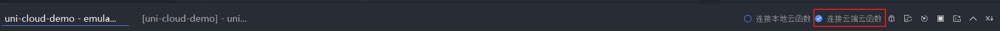
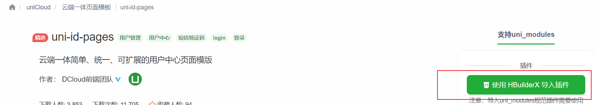

# uni-id用户系统

`uni-id` 是 `uniCloud` 提供的一个通用用户系统，包括用户注册登录等常用 api

`uni-id` 非常复杂 包括很多的模块 这里介绍 `uni-id-co` 和 `uni-id-pages` 模块

> **注意:** 用户系统的使用请切换到云端函数而非本地函数进行开发



## 安装

安装 `uni-id` 需要用到很多模块，为了方便的安装，可以直接安装 `uni-id-pages`，它包含所有要用到的模块

[下载地址](https://ext.dcloud.net.cn/plugin?name=uni-id-pages)

请点击按钮下载模块



然后根据向导完成操作

安装好后在 `uniCloud` 文件夹下会多出许多 云函数 和 云数据库表

然后上传云数据库和云函数相关内容

## 配置

首先请在以下目录 `uniCloud/cloudfunctions/common/uni-config-center/uni-id/config.json` 创建一个配置文件 `config.json`

然后配置文件如下

```json
{
  "passwordSecret": [
    {
      "type": "hmac-sha256",
      "version": 1
    }
  ],
  "passwordStrength": "medium",
  // tokenSecret 是加密用的密钥 请自行填写
  // 其余配置都可以用推荐配置
  "tokenSecret": "xxxxxxxx",
  "requestAuthSecret": "",
  "tokenExpiresIn": 7200,
  "tokenExpiresThreshold": 3600,
  "passwordErrorLimit": 6,
  "passwordErrorRetryTime": 3600,
  "autoSetInviteCode": false,
  "forceInviteCode": false,
  "app": {
    "tokenExpiresIn": 2592000,
    "tokenExpiresThreshold": 864000
  },
  "web": {
    "tokenExpiresIn": 7200,
    "tokenExpiresThreshold": 3600
  }
}
```

配置好后 请上传 `uni-config-center`

## 使用

此处介绍最常见的 `注册` `登录` `登出`

不直接使用 `uniCloud` 提供的页面时，使用 `uni-id-co` 云对象来调用各个 api

所以可以先引入云对象

```js
const uniIdCo = uniCloud.importObject('uni-id-co')
```

### 注册

注册需要先获取图形验证码

```js
// 创建验证码
const result = await uniIdCo.createCaptcha({
    // 场景参数是固定的不能乱写
    // 参考: https://uniapp.dcloud.net.cn/uniCloud/uni-id-summary.html#captcha-scene
    scene: 'register'
})
// 返回值中的 captchaBase64 就是验证码图片
// 赋值给一个图片的 src 用来显示验证码
this.captchaImg = result.captchaBase64
```

然后就可以调用注册接口

```js
const result = await uniIdCo.registerUser({
    // 用户名
    username: 'abc',
    // 密码
    password: 'a11111111',
    // 图形验证码
    captcha: this.captcha,
    // 昵称
    nickname: '张三'
})
```

返回值的数据结构如下

```json
{
    "errCode": 0,
    "uid": "63d76ba0f43e60b2ba713631",
    // newToken 是登录成功后返回的凭证
    // 注册成功后会自动登录
    "newToken": {
        // 登录成功后需要保存以下两个参数
        // token 是登录凭证
        "token": "xxxxxxxx",
        // tokenExpired 是登录的过期时间
        "tokenExpired": 1677654176469
    },
    "passwordConfirmed": true
}
```

获取到登录成功后的数据后，我们需要保存到本地

```js
// 注册
const result = await uniIdCo.registerUser({
    ...
})
// 保存登录参数
uni.setStorageSync('uni_id_token', result.newToken.token)
uni.setStorageSync('uni_id_token_expired', result.newToken.tokenExpired)
```

> **注意:** 保存登录参数时的 key 名称是固定的，不能自定义

### 登出

```js
// 登出不需要参数
const result = await uniIdCo.logout()
// 若登出没有出错就删除登录凭证
if(result.errCode === 0) {
    uni.removeStorageSync('uni_id_token')
    uni.removeStorageSync('uni_id_token_expired')
}
```

### 登录

```js
// 登录
const result = await uniIdCo.login({
    // 用户名
    username: 'abc',
    // 密码
    password: 'a11111111',
    // 验证码非必填
    // captcha
})
// 登录完后需要保存登录凭证
uni.setStorageSync('uni_id_token', result.newToken.token)
uni.setStorageSync('uni_id_token_expired', result.newToken.tokenExpired)
```

### 获取登录状态

通常一个拥有账号系统的应用，都需要通过判断当前登录状态然后在页面显示不同的内容，例如此处我们做这样的 demo，若已登录 则页面显示 `用户昵称` 否则显示 `未登录`

```js
export default {
    data() {
        return {
            // 是否登录
            isLogin: false,
            // 昵称
            nickname: ''
        }
    },
    onShow() {
        // 通过 uniCloud.getCurrentUserInfo 解析登录凭证，获取当前登录用户的部分信息
        const info = uniCloud.getCurrentUserInfo()
        // 若没有登录的话 info.uid 值为 null
        if (info.uid !== null) {
            // info.uid 不为空则说明当前用户已登录
            this.isLogin = true
            // 查询用户名
            // 注意: 此处查询用户信息时需要用 field 方法来过滤字段 否则由于权限原因无法查询用户的所有数据 因为用户数据包含账号密码等敏感信息
            db.collection('uni-id-users').doc(info.uid).field('nickname').get({getOne: true}).then(result => {
                console.log(result);
                this.nickname = result.result.data.nickname
            }).catch(reason => {
                console.log(reason);
            })
        }
    }
}
```

> **注意:** 查询用户信息时需要用 `field` 方法来过滤字段 否则由于权限原因无法查询用户的所有数据 因为用户数据包含账号密码等敏感信息

> **注意:** `uniCloud.getCurrentUserInfo` 方法是通过本地存储的 `uni_id_token` 和 `uni_id_token_expired` 解析数据的，所以使用 `uni.setStorageSync` 时，不能乱取名字

## uni-id-page

`uni-id-page` 是 uniCloud 已经做好的一套客户端界面，在安装的时候已经自动注册了这些页面到 `pages.json` 中，所以我们可以直接访问这些页面