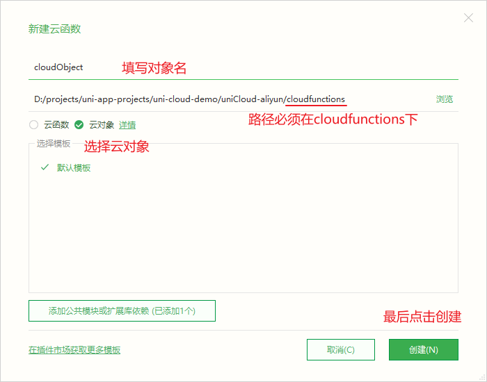
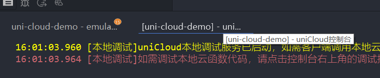
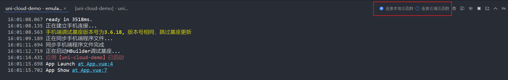
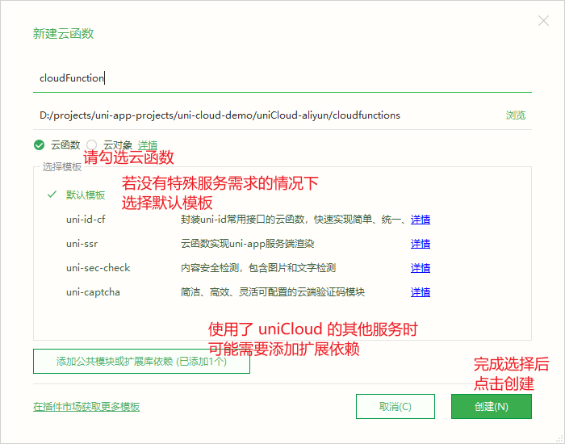

# 云对象和云函数

## 云对象

[参考](http://zh.uniapp.dcloud.io/uniCloud/cloud-obj.html)

一个存储在云端的对象就是 `云对象`

需要通过网络来访问 `云对象`

### 声明云对象

对着 `cloudfunctions` 文件夹右键 -> `新建云函数/云对象`

然后如下图进行选择



创建好后，会泽 `cloudfunctions` 文件夹下生成一个 `cloudObject` 文件夹

打开 `index.obj.js` 即可编辑云对象，例如:

```js
module.exports = {
	name: '这是云对象name属性',
	sum(num1, num2) {
		// return num1 + num2
		// 按照规范应该返回如下格式
		return {
			errCode: 0,
			errMsg: '操作成功',
			sum: num1 + num2
		}
	}
}
```

### 运行项目

运行一个启用 uniCloud 的项目时，会多出一个进程 如图:



可以通过以下按钮切换使用本地函数(或对象)还是使用云函数(或对象)



> **注意:** 使用本地函数时，需要让手机和电脑连接在同一网络下

> **注意:** 使用云函数时，需要右键对应函数文件夹并上传到云端

### 调用云对象

创建一个按钮，点击调用云对象，如下:

```html
<template>
	<view>
		<button @click="callCO">调用云对象</button>
	</view>
</template>
```

```js
export default {
    data() {
        return {}
    },
    methods: {
        // 注意此函数是个异步函数
        async callCO() {
            // 使用 uniCloud.importObject 引入云对象
            const co = uniCloud.importObject('cloudObject')
            // 调用云对象的方法时 使用 await 进行同步调用
            console.log(await co.sum(1, 2))
        }
    }
}
```

> **注意:** 云对象不应该存储对象属性，因为在客户端无法访问，例如上述对象 `cloudObject` 中的 `name` 属性

## 云函数

[参考](http://zh.uniapp.dcloud.io/uniCloud/cf-callfunction.html)

云函数是一个存储在云端的函数，用于充当服务器接口(云函数内书写服务端的逻辑)

调用云函数的网络过程被 uni-app 封装，所以不必考虑网络协议的问题

### 声明云函数

对着 `cloudfunctions` 文件夹右键 -> `新建云函数/云对象`

然后如下图进行选择



声明好云函数后，会在 `cloudFunctions` 文件夹下多出对应名称的文件夹，然后打开文件夹下的 `index.js` 文件编写云函数

例如: 此处我的云函数名为 `cloudFunction` 所以打开文件 `cloudFunctions/cloudFunction/index.js` 编写如下内容

```js
'use strict';
exports.main = async (event, context) => {
	//event为客户端上传的参数
	console.log('event : ', event)

	//返回数据给客户端
	return {
		errCode: 0,
		errMsg: '操作成功',
		// 此处做了个参数的加法运算
		result: event.num1 + event.num2,
		// 返回云函数上下文
		context
	}
};
```

### 调用云函数

在客户端页面中，创建一个按钮，编写事件回调如下

```html
<template>
	<view>
		<button @click="callCO">调用云对象</button>
		<button @click="callCoFunction">调用云函数</button>
	</view>
</template>
```

```js
export default {
    data() {
        return {}
    },
    methods: {
        async callCO() {
            const co = uniCloud.importObject('cloudObject')
            console.log(await co.sum(1, 2))
            console.log(await co.div(1, 2))
        },
        async callCoFunction() {
            // 使用 uniCloud.callFunction 调用云函数
            // 获取云函数返回值的方法有两种
            // 方法一: 通过 await 调用并获取返回值
            const result = await uniCloud.callFunction({
                // 云函数名
            	name: 'cloudFunction',
                // 函数参数
            	data: {
            		num1: 3,
            		num2: 5
            	}
            })
            console.log(result);
            // 方法二: 通过 success 回调函数获取返回值
            uniCloud.callFunction({
                name: 'cloudFunction',
                data: {
                    num1: 3,
                    num2: 5
                },
                success: (result) => {
                    console.log(result);
                }
            })
        }
    }
}
```