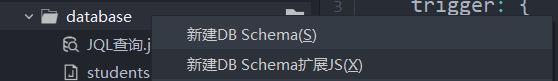
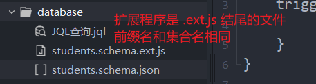

# 云数据库

云数据库是一个云端的数据库，用于保存数据。

云数据库采用的是 `阿里云` 或 `腾讯云` 的 `NoSql` 数据库 `MongoDB`

选择云空间的供应商时决定了此数据库由那家云平台提供

由于数据库是 `MongoDB` 所以 uniCloud 在访问数据库时支持 `MongoDB` 命令，同时 uniCloud 还提供了 `JQL(Javascript Query Language)` 语法来访问数据库，该语法更简单，让不熟悉 `MongoDB` 的开发也能方便调用数据库

`MongoDB` 的一大特点就是 `js驱动` 和 `json数据结构`

- `js驱动`: `MongoDB` 的数据库命令使用 `js` 驱动的，所以可以用 `js` 代码来控制数据库的 `crud`
- `json数据结构`: `MongoDB` 中的数据结构采用的是 `json` 格式

## 名词解释

在 `NoSql` 数据库中，有些名词解释和 `Sql` 数据库不同，对应关系如下

| **关系型**          | **JSON 文档型**                                         |
| ------------------- | ------------------------------------------------------- |
| 数据库 database     | 数据库 database                                         |
| 表 table            | 集合 collection。但行业里也经常称之为“表”。无需特意区分 |
| 行 row              | 记录 record / doc                                       |
| 字段 column / field | 字段 field                                              |
| 使用sql语法操作     | 使用MongoDB语法或jql语法操作                            |

- 一个 `uniCloud` 服务空间，有且只有一个数据库
- 一个数据库可以有多个表
- 一个表可以有多个记录
- 一个记录可以有多个字段

## 创建集合

创建集合有两种方式

- 通过代码，添加数据到一个不存在的集合时，数据库会自动创建集合
- 通过 `uniCloud web 控制台` 的 `GUI` 界面
  

这里主要介绍通过 `uniCloud web 控制台` 的 `GUI` 界面创建集合

点击加号后，输入表名并点击创建


添加好集合后，需要设计表结构


点击页面中的编辑按钮编辑内容如下:

```json
{
  "bsonType": "object",
  "required": [],
  // 增删改查的读写权限
  "permission": {
    "read": true,
    "create": true,
    "update": true,
    "delete": true
  },
  // 字段
  "properties": {
    // id 字段是数据库自动生成的 不需要额外配置
    "_id": {
      "title": "id",
      // 字段描述
      "description": "ID，系统自动生成"
    },
    // 自定义字段
    "name": {
      // 字段类型
      // bsonType 的可选值，参考: http://zh.uniapp.dcloud.io/uniCloud/schema.html#bsontype
      "bsonType": "string",
      // 列标题
      "title": "姓名"
    },
    "sex": {
      "bsonType": "string",
      "title": "性别"
    },
    "age": {
      "bsonType": "int",
      "title": "年龄"
    },
    "createdAt": {
      "bsonType": "date",
      "title": "创建时间"
    },
    "updatedAt": {
      "bsonType": "date",
      "title": "更新时间"
    }
  }
}
```

然后添加字段索引


索引是什么？索引是数据库为了查询方便添加的一个标识，当开发者认为某个字段会被频繁查询时，那么该字段就应该添加索引

这里我们先添加一个 `name` 字段对应的索引 `_name`


用相同方法给所有字段添加索引，如下:


> **注意:** 唯一索引的意思是: 该字段的值只能在集合中出现一次，例如 `name` 字段若添加了唯一索引，则名字叫做 `张三` 的人，在集合中只能出现一次

至此集合创建完毕

此时在本地的 `HBuilder` 中还不存在该数据结构，所以可以在 `database` 文件夹下右键并下载内容，如:


## 数据库扩展程序

`数据库扩展程序` 是 uniCloud 提供的，用来控制数据库被访问的过程中的一些数据处理的程序。

例如: 上文中的 createdAt 字段，若希望在每次新增数据时自动添加该字段的值；又或者希望每次修改数据后自动更新 updatedAt 字段，则可以使用 `数据库扩展程序`

在 `database` 文件夹下右键进行创建，如图:



> **注意:** 扩展程序的名称前缀需要和集合名相同如:



### 编辑扩展程序

[参考](https://uniapp.dcloud.net.cn/uniCloud/jql-schema-ext.html)

[示例](https://uniapp.dcloud.net.cn/uniCloud/jql-schema-ext.html#demo)

扩展程序目前只有触发器 `trigger` 官方未来会引入更多功能

以 `createdAt` 和 `updatedAt` 的自动添加和修改为例，编辑如下:

```js
module.exports = {
	trigger: {
		// 新增数据前
		beforeCreate: async function({
			collection,
			operation,
			addDataList,
			clientInfo
		} = {}) {
			// addDataList 是新增的数据列表
			// 可能是批量增加 所以 addDataList 是数组
			for (let i = 0; i < addDataList.length; i++) {
				const addDataItem = addDataList[i]
				const now = new Date()
				// 添加数据前自动添加以下两个字段的时间值
				addDataItem.createdAt = now
				addDataItem.updatedAt = now
			}
		},
		// 更新数据前
		beforeUpdate: async function({
			collection,
			operation,
			where,
			updateData,
			clientInfo
		} = {}) {
			if (Reflect.ownKeys(updateData).length > 0) {
				// updateData 要更新的数据对象
				updateData.updatedAt = new Date()
			}
		}
	}
}
```

## 上传或下载数据库结构和扩展程序

和云函数不同，云数据库的任何修改都应该通过上传或下载操作同步本地和云端的配置。方法很简单，在 `database` 文件夹下右键，选择上传或下载配置即可，例如


## 语法

crud 语法请参考 [index.vue](./uni-cloud-demo/pages/index/index.vue)

查询语句和指令请参考 [JQL查询.jql](./uni-cloud-demo/uniCloud-aliyun/database/JQL%E6%9F%A5%E8%AF%A2.jql)