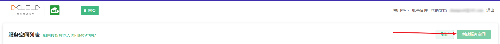

# 环境搭建

## 创建HBuilder账号

[注册](https://dev.dcloud.net.cn/pages/common/register?redirect_uri=https%3A%2F%2Funicloud.dcloud.net.cn)

## uniCloud web 控制台

[uniCloud web 控制台](https://unicloud.dcloud.net.cn/pages/login/login) 是用于管理云开发时产生的云空间的控制台

注册号账号后就登录控制台

## 云空间

uniCloud 中一个 `云空间` 代表一个隔离的数据空间，包含云数据库，云函数，云存储等功能。

进入 `uniCloud web 控制台` 后，创建一个云空间

由于云空间提供 `阿里云` 和 `腾讯云` 教学中以 `阿里云` 为例

创建好云空间后 点击进入，如图:

后续关于云端的数据操作，都可以通过该 `uniCloud web 控制台` 完成

## 配置 uni-app 项目

在项目文件夹下右键，并选择如图选项

项目目录下会多出一个 `uniCloud` 文件夹

右键该文件夹关联先前创建好的云空间，如图:

## 配置 appid

使用 uniCloud 时需要给你的应用添加 appid

在 manifest.json 中 `基础配置` 的第一个进行配置，若不存在 appid 就点击 `重新获取`

还有一个方法，可以登录 [开发者平台](https://dev.dcloud.net.cn/)，然后手动创建应用

至此 `uniCloud` 环境就搭建完成了