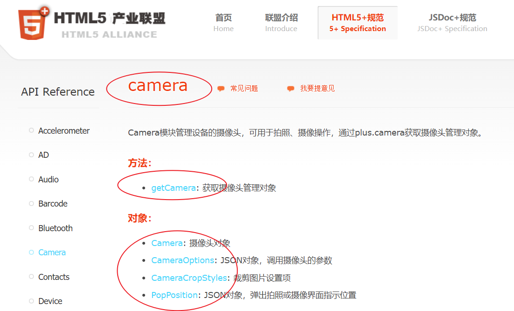

# 调用本地行为(native behavior)

设备特有的功能，例如 `app` 端调用摄像头，通讯录，定位，地图，相册等

这些功能就是本地 (native) 功能

调用 app 的本地功能 可以查看 [官网](https://www.html5plus.org/doc/h5p.html)

这里以调用摄像头为例，进行演示

## 查找需要的模块

先查找到我们需要的模块


然后点开模块

下图中的内容 代表的是 `camera` 模块中的内容



## 访问模块

要访问 模块内容 我们使用 `plus.<module>` 进行访问，例如此处 `plus.camera`，然后访问其中的 `getCamera` 方法就是这样: `plus.camera.getCamera()`

## 开启摄像头的例子

```js
// 获取摄像头对象
var cmr = plus.camera.getCamera();
// 捕获图像
cmr.captureImage(
    // 成功的回调
    (capturedFile) => {
        // capturedFile 被捕获图像的 url
        console.log(capturedFile);
    },
    // 异常的回调
    (error) => {
        console.error(error);
    },
    // 其他配置参数
    {
        // 裁剪
        crop: {
            width: 600,
            height: 600,
        },
    }
);
```
