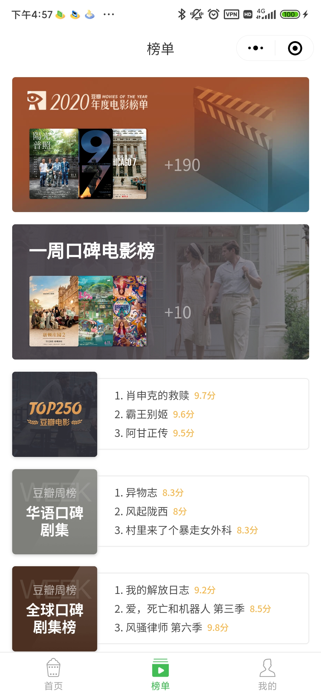
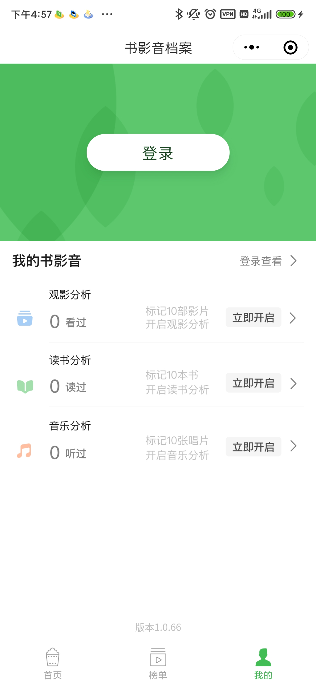

# 笔记

## 数据接口

数据请求接口需要做一个代理服务器

接口地址: 

基础地址: https://movie.douban.com

url | 参数 | 功能
--- | --- | ---
/j/search_tags | { type: '类型 movie(电影) 或 tv(电视剧)' , source: 'index(代表查询首页的tags)'} | 查询tags
/j/search_subjects | {type:'类型',tag:'标签',page_limit: '数据量', page_start: '第几页'} | 查询tags 对应的数据列表
/j/subject_abstract | { subject_id: '从上面接口查询出的数据id' } | 详细信息

## 页面效果图

