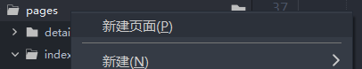
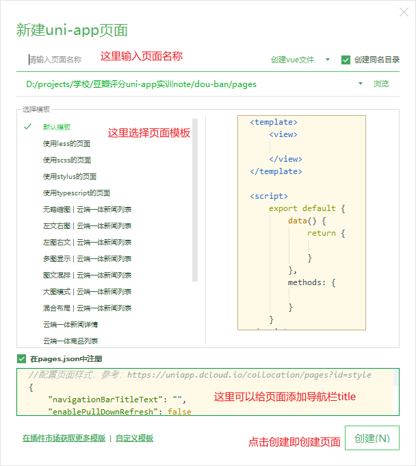

# 页面和基本组件

## 创建页面

对着 `pages` 文件夹右键 `新建页面`

然后填入选项点击 `创建`

创建的页面就是一个 `vue.js` 的单文件组件

> 注意: 创建页面时会在 `pages.json` 中自动添加配置，所以删除页面时，请手动清除 `pages.json` 中的页面配置

### 页面配置

`pages.json` 的详细配置，请参考[详情](https://uniapp.dcloud.io/collocation/pages.html#%E9%85%8D%E7%BD%AE%E9%A1%B9%E5%88%97%E8%A1%A8)

常见配置有:

选项 | 类型 | 必填 | 描述
--- | --- | --- | ---
[globalStyle](https://uniapp.dcloud.io/collocation/pages.html#globalstyle) | Object | 否 | 页面的全局样式，应用后，所有页面都会生效
[pages](https://uniapp.dcloud.io/collocation/pages.html#pages)| Object Array | 是 | 每个页面的配置

pages 的配置如下

属性 | 类型 | 描述
--- | --- | ---
path | String | 页面路径
style | Object | 独立页面的样式（相对全局配置 globalStyle），具体配置可以查看 [pageStyle](https://uniapp.dcloud.io/collocation/pages.html#style)

## 基础标签

`html` 的 `div` 标签，在 `uni-app` 中就是 `view` 标签

`html` 的 `span` 标签，在 `uni-app` 中就是 `text` 标签

其余内置标签可以查看[详情](https://uniapp.dcloud.io/component/view.html)
